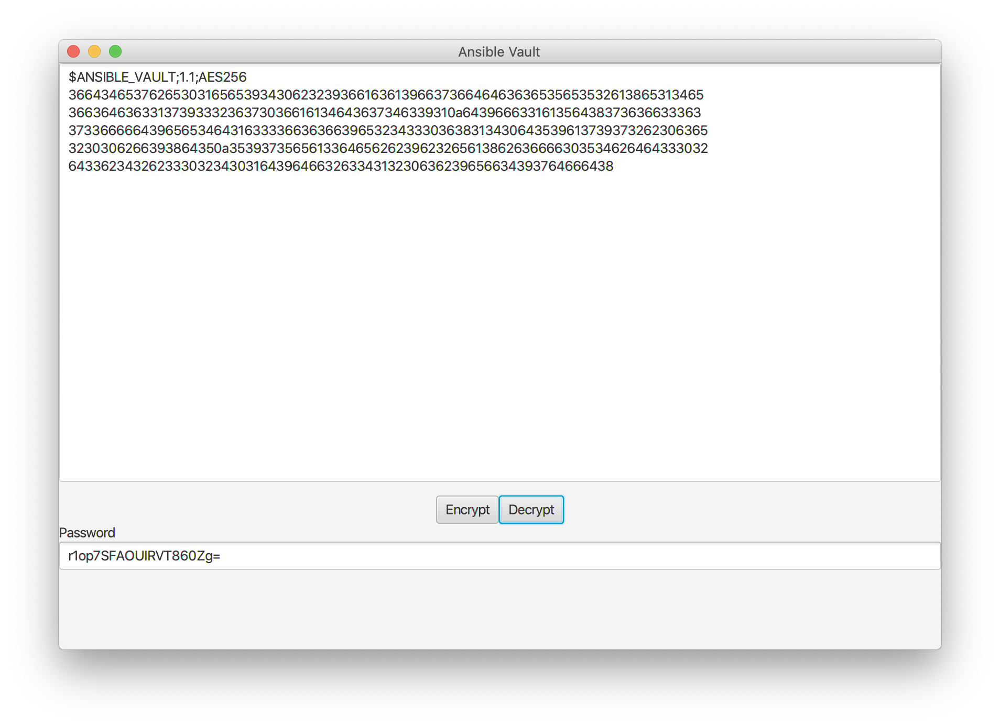

# Java Ansible Vault JavaFX Application

This application allows you to handle Ansible encrypted vaults.

## Quick examples

Here are a couple of examples of how you could use this library

### Easy peasy

Paste an encrypted vault variable into the text area   

... And press `Decrypt`   

Or press `Encrypt` on a clear test vault variable   

JavaAnsibleVault uses https://github.com/EsotericSoftware/yamlbeans for serializing/deserializing
objects to and from Ansible Vaults. This gives you very convenient ways of handling the vaults from
Java.

## Notices and Limitations
The library handles only the newest (version 1.1) format of the vaults. It will cry and crash and burn with any previous versions of the vaults.

_**Ansible uses 256 bits keys to handle encryption and decryption of the vaults, this means that
in order to handle these vaults you will need to install the unrestricted policy files from Oracle.
You have been warned.**_
